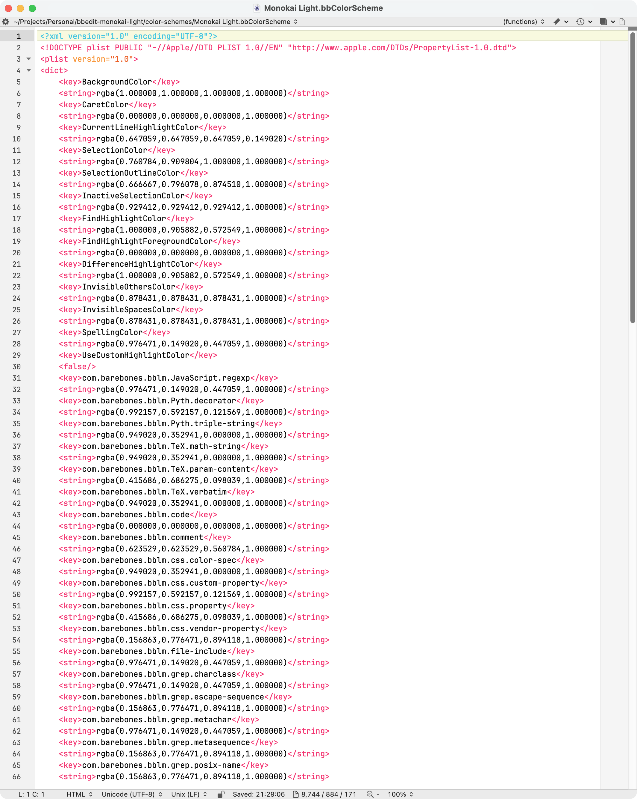

# Monokai Light for BBEdit

## About



Monokai Light-inspired color scheme for BBEdit with crisp syntax contrast on a white background. The palette mirrors the classic Monokai scopes (comments, keywords, strings, numbers, and markup) while tuning selection and highlight colors for BBEdit.


<br clear="all">

## Quick Install

Run the installer directly from the repository:

```
curl -fsSL https://raw.githubusercontent.com/binbinsh/bbedit-monokai-light/main/install.sh | sh
```

The script downloads `Monokai Light.bbColorScheme`, creates `~/Library/Application Support/BBEdit/Color Schemes` if needed, backs up any existing copy, and places the new scheme in that folder.

## Manual Install

1. Download `color-schemes/Monokai Light.bbColorScheme` from the repository.
2. Copy the file to `~/Library/Application Support/BBEdit/Color Schemes/`.
3. Restart BBEdit if it was running.

## Using the Theme

- Open BBEdit and go to `BBEdit ▶ Settings ▶ Text Colors`.
- Select **Monokai Light** from the color schemes list.
- Inspect sample code to confirm highlight colors (keywords in pink, strings in orange, numbers in violet, types in aqua, and comments in muted gray).

## Updating or Removing

- Re-run the install command to update in place; the script backs up the existing file with a timestamp.
- To remove the scheme, delete `~/Library/Application Support/BBEdit/Color Schemes/Monokai Light.bbColorScheme` and choose another scheme inside BBEdit.

## License

This project is licensed under the Apache License 2.0. See the [LICENSE](LICENSE) file for details.
